[](https://github.com/namnp081296/udacity-devops-cloud-lab2/actions/workflows/pythonflaskml.yml)

# Overview
This project will show you how to completely implement DevOps process in building FlaskML app by using the CI/CD tool include Github Actions and Azure Devops pipeline.
After you finish this project, you'll learn:
* How to install and using python tool like pip, pylint, pytest and create the env for testing app before apply it to process
* How to configure Github Actions to implement CI for checking code score, syntax, bugs,...
* How to configure Azure Devops to implement CD for delivering application to production

## Project Plan
* [Project plan](docs/lab02-plan.xlsx)
* [Tracking Trello Board](https://trello.com/b/6Bz6jB9R/udacity-ml-app)

## Architectural Diagram
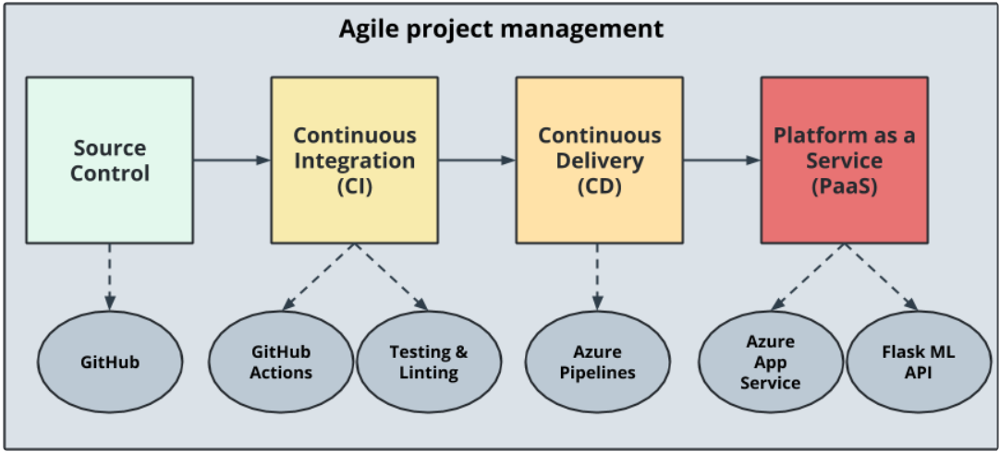

## Instructions
### Step 1: Deploy project with Azure Cloud Shell  
* Clone the Project
You need to access to the Azure Cloud Shell first, remember to select the **Bash Shell**. Then, run these commands below:
```
git clone git@github.com:namnp081296/udacity-devops-cloud-lab2.git
cd udacity-devops-cloud-lab2
```
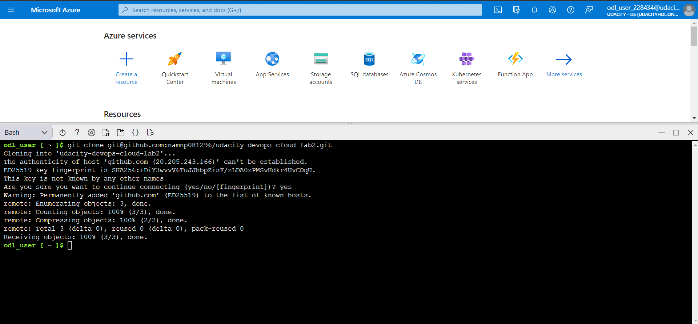

* Create the Python virtual environment
```
python3 -m venv .lab2-venv
source .lab2-venv/bin/activate
```
	
* Let's first make the lint and test
```
make all
```
You'll see an error like "W0702: No exception type...". 
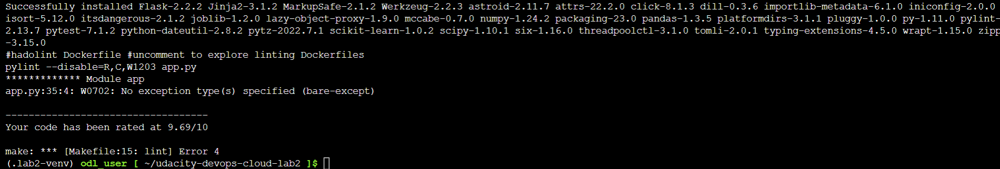
Try edit the Makefile and add it to lint section, then rerun the command
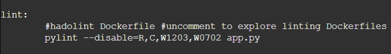
Result
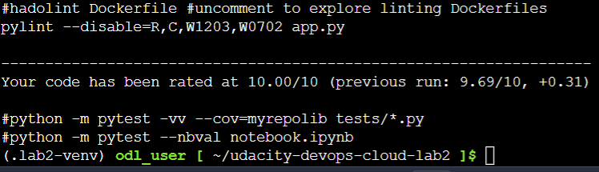

* Deploy project to Azure App Service
```
make deploy
```
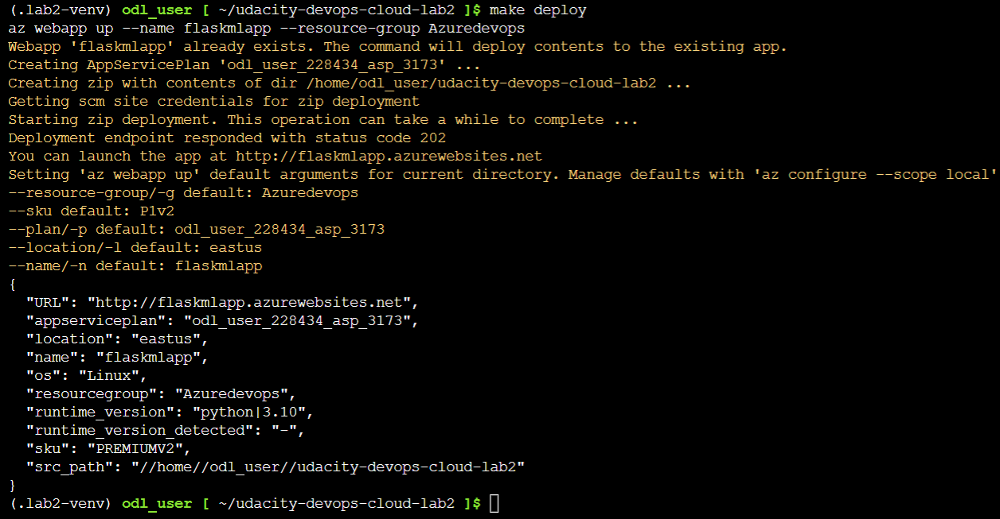

### Step 2: Configure Github Actions for CI
After testing success in virenv. Next, we'll configure the Github Actions for implementing CI. First, you need to go to your project, and then select **Action** -> **setup a worlflow yourself**, then paste these following code:
```
name: Lab02 ML Flask App Service

on: [push]

jobs:
  build:
    runs-on: ubuntu-latest
    steps:
    - uses: actions/checkout@v2
    - name: Setup Python 3.8
      uses: actions/setup-python@v1
      with:
        python-version: 3.8
    - name: Install Dependencies
      run: |
        make install
    - name: Lint with pylint
      run: |
        make lint
    - name: Test with pytest
      run: |
        make test
```
Then commit the file. After that, it'll be triggered to run the first time. Here's the result
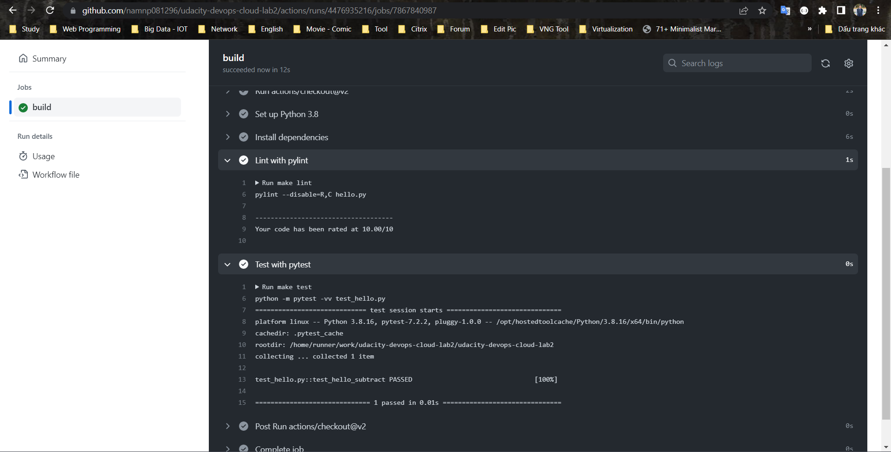

### Step 3: Deploy project with Azure DevOps
In this step, we'll configure the Azure Pipeline in Azure Devops. This pipeline have two main steps and there're Build and Deploy
* [You can follow these step to configure pipeline](https://docs.microsoft.com/en-us/azure/devops/pipelines/ecosystems/python-webapp?view=azure-devops#create-an-azure-devops-project-and-connect-to-azure).

Here's the result 
* Deploy project
Build Step
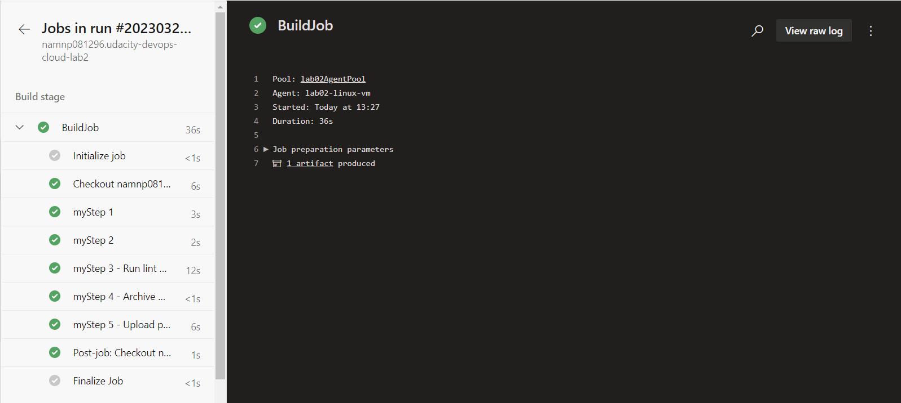
Deployment Step
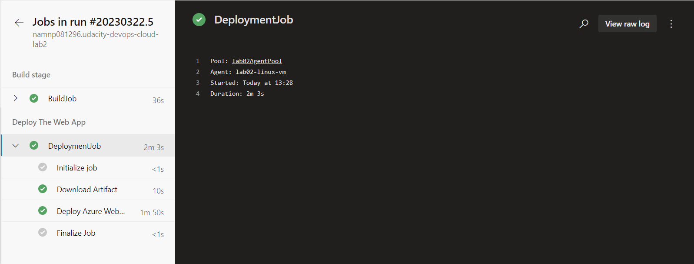

### Step 4: Verify application is deployed
To make sure the Flaskml deployed to Azure Portal. Do these following substeps.
* You need to go to the portal. Type "App Service" and select. Select the application.
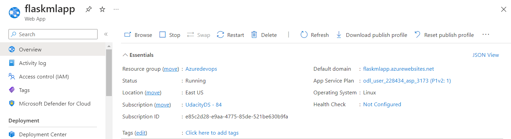

* Next, run the prediction script in Azure Cloud Shell to call prediction API.
You will get the result as image below
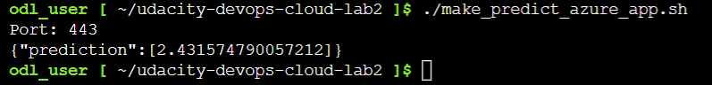

* Check the output of streamed log files
```
az webapp log tail --resource-group Azuredevops --name flaskmlapp
```
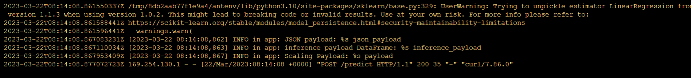

## Enhancements
There are some suggestions for improving the project as:
* Develop the UI of the FlaskML App
* Build it and compress into an image such as Docker image
* Add more testing step like Unit Test, Integraton Test,..

## Demo
https://drive.google.com/drive/u/0/folders/1_x7376wKo50UCVK_o63vySJXqAGZSjVo
